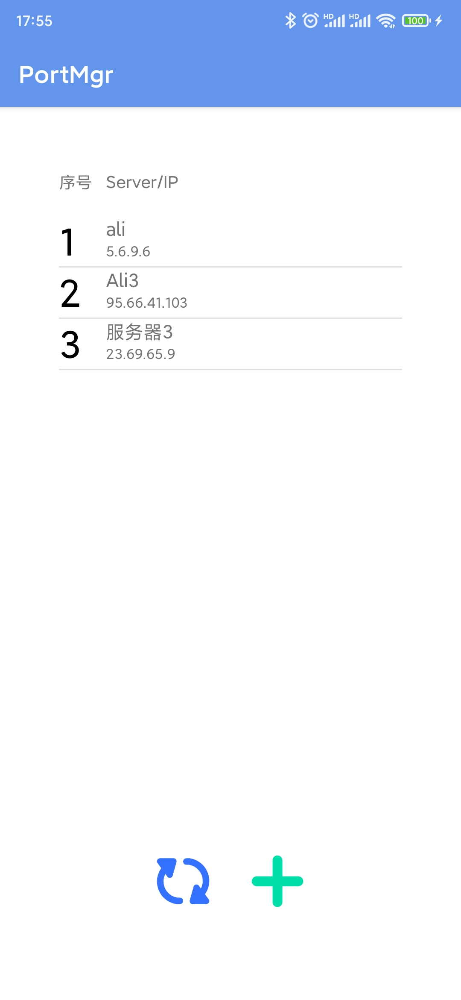
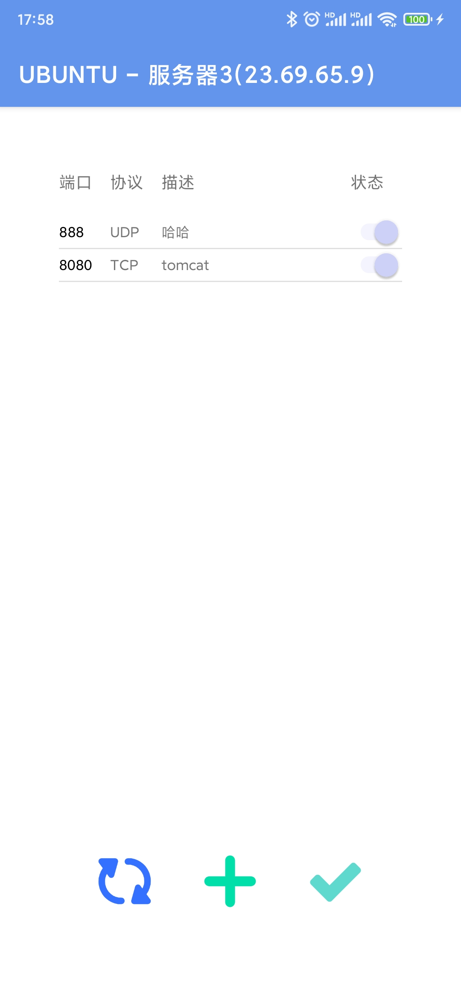

# Port Manager (Linux)

> Android APP (安卓端)

# Supported OS: 

- centos
- ubuntu (TODO...)

# Ability

- add server and manage it's port(enable, disable, comment)

# ScreenShots

|  |  |
| :---------------------------------: | :-----------------------------------: |
|            Server Manage            |              Port Manage              |

